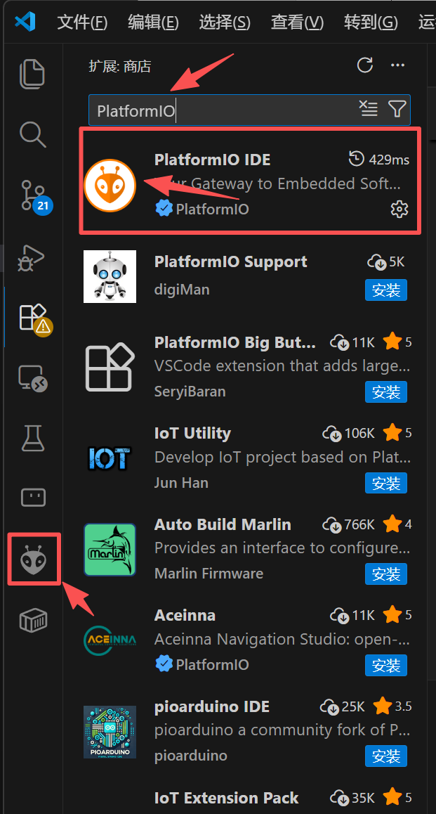
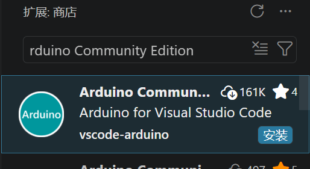
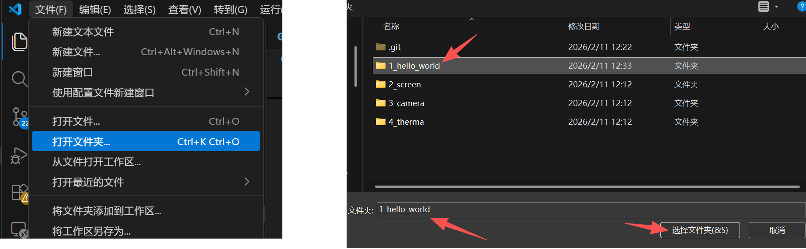
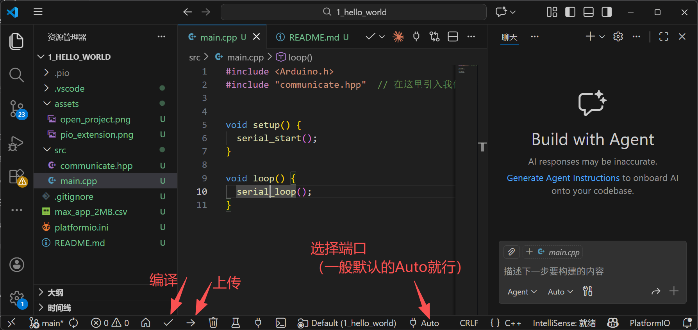
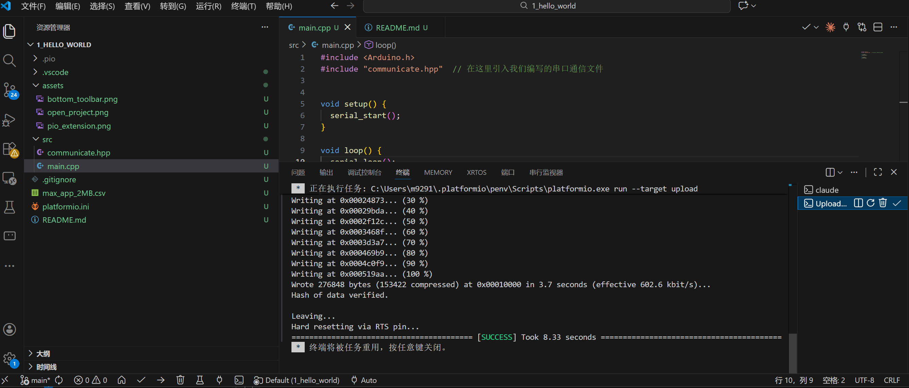
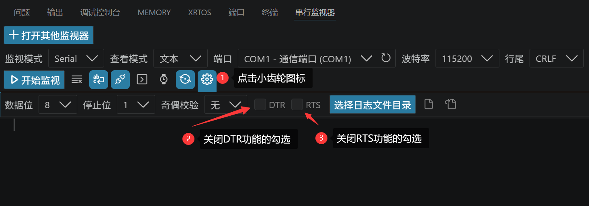
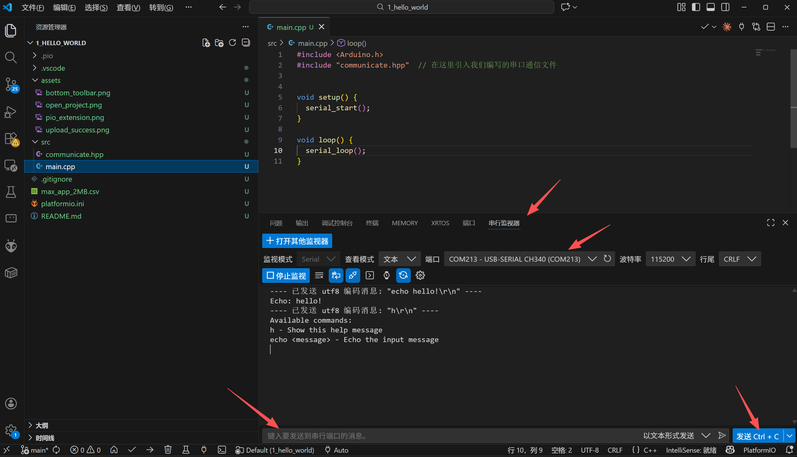

# ESP32 PlatformIO 萌新指南 第一课-串口交互基础项目

欢迎来到 VS Code 和 PlatformIO 的世界！🎉

如果你习惯了 Arduino IDE 的那个圆形的“编译”和“上传”按钮，刚打开 VS Code 时可能会觉得界面太复杂、按键太多。别担心！这篇指南就是为你准备的。**你不需要输入任何复杂的命令行**，只要跟着图文点击几个按钮，就能轻松跑通这个项目。

本项目实现了一个简单的 ESP32 串口交互功能：板子启动后会等待你的指令，你可以输入 `h` 查看帮助，或者输入 `echo 你的内容` 让板子把你的话学一遍。

---

## 🛠️ 第一步：准备工作 (下载与安装)

在开始之前，请确保你已经准备好了基础工具：

1. **下载并安装 VS Code**: [点击这里前往官网下载 Visual Studio Code](https://code.visualstudio.com/)。
2. **安装 PlatformIO 插件**: 打开 VS Code 后，点击左侧边栏的“扩展 (Extensions)”图标（由四个方块组成），在搜索框输入 `PlatformIO IDE` 并点击安装。安装完成后，左侧会出现一个“外星人头”图标。

3. **安装 Arduino-ce 插件**: 在搜索框输入 `Arduino Community Edition` 并点击安装。

---

## 📂 第二步：打开项目与认识代码

在传统的 Arduino IDE 中，你通常是双击打开一个 `.ino` 文件。但在 PlatformIO 中，我们是以**文件夹（项目）**为单位来工作的。

1. 打开 VS Code。
2. 点击左上角的 `文件 (File)` -> `打开文件夹 (Open Folder)`。
3. 选择包含 `platformio.ini` 文件的那个项目根目录，点击“选择文件夹”。

**💡 注意：首次打开项目，会下载ESP32的编译环境，整个过程时间会非常久**

**💡 它默认从github拉取编译环境，国内用户如果一直失败可能需要一些上网的魔法**

> 展开左侧资源管理器中的 `src` (Source，源码) 文件夹，你会看到 `main.cpp` 和 `communicate.hpp`。
> * **`main.cpp`**：相当于你以前的 `.ino` 核心文件，里面有你熟悉的 `setup()` 和 `loop()`。
> * **`communicate.hpp`**：这是我们把具体的串口交互逻辑单独抽出来放在这里的“外包文件”，这样能让主程序 `main.cpp` 看起来更清爽！
---

## ⚙️ 第三步：认识底部的“魔法工具栏”

PlatformIO 把最常用的功能都为你整理好了，就放在 VS Code 界面**最下方的那一排蓝色小图标**里。你只需要认识其中最关键的三个：

* **✓ (Build / 编译)**：检查代码有没有写错，把它翻译成机器能看懂的语言。
* **→ (Upload / 烧录)**：把编译好的程序下载到你的 ESP32 板子上。
* **🔌 (Serial Monitor / 串口监视器)**：打开一个小窗口，用来和板子对话（查看输出、发送指令）。

---

## 🚀 第四步：编译与烧录

现在，用数据线把你的 ESP32 开发板连上电脑。

1. **编译**：先点击底部的 **✓ (编译)** 按钮。稍微等待一会，如果底部终端弹出一堆绿色的文字并显示 `SUCCESS`，说明代码完美无缺！
2. **烧录**：点击底部的 **→ (烧录)** 按钮。PlatformIO 会自动帮你找到 ESP32 的串口，并把固件写进去。看到进度条跑到 100% 并显示 `SUCCESS`，就说明烧录成功了。

> **⚠️ 特别提醒：关于 2MB Flash 的自动配置**
> 本项目为双光热成像主板 ESP32 做了自动化配置。在 Arduino IDE 中，你通常需要手动在菜单里选各种开发板配置，但在本项目的 `platformio.ini` 文件中，一切都已自动配置好，你直接点烧录即可，绝不报错！

---

## 💬 第五步：打开串口监视器聊天

烧录完成后，我们来测试一下真正的功能：

1. 使用ArduinoCE的 **串行监视器** 打开串口监视器。由于USBCDC串口的兼容性问题，注意需要关闭RTS和DTR功能：

2. 按下 ESP32 板子上的 `RST` 或 `EN` 按钮重启一下板子。
3. 你会看到屏幕上打印出：`Serial communication initialized.`
4. 在终端的输入框中敲入 `h`，然后按回车。板子会立刻回复你可用的命令菜单。
5. 试着输入 `echo Hello ESP32!` 并回车，看看板子是不是乖乖学你说话了！
6. 重新下载程序时，要记得串口监视器停止监视，**否则串口被占用时是无法下载程序的**

---

## 🎉 恭喜通关！

你已经成功迈出了脱离 Arduino IDE、掌握现代嵌入式开发工具的第一步。接下来，你可以尝试打开 `src/communicate.hpp` 文件，在里面添加更多的 `else if` 分支，创造属于你自己的专属串口指令！