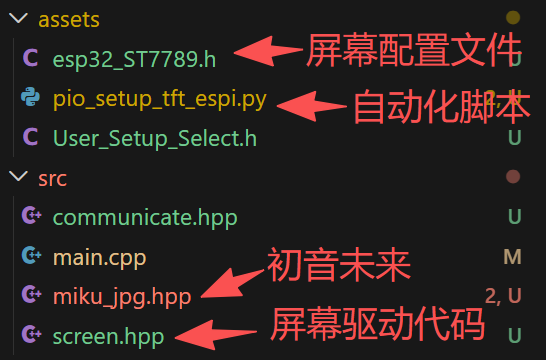
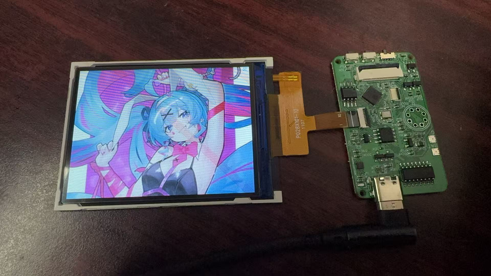
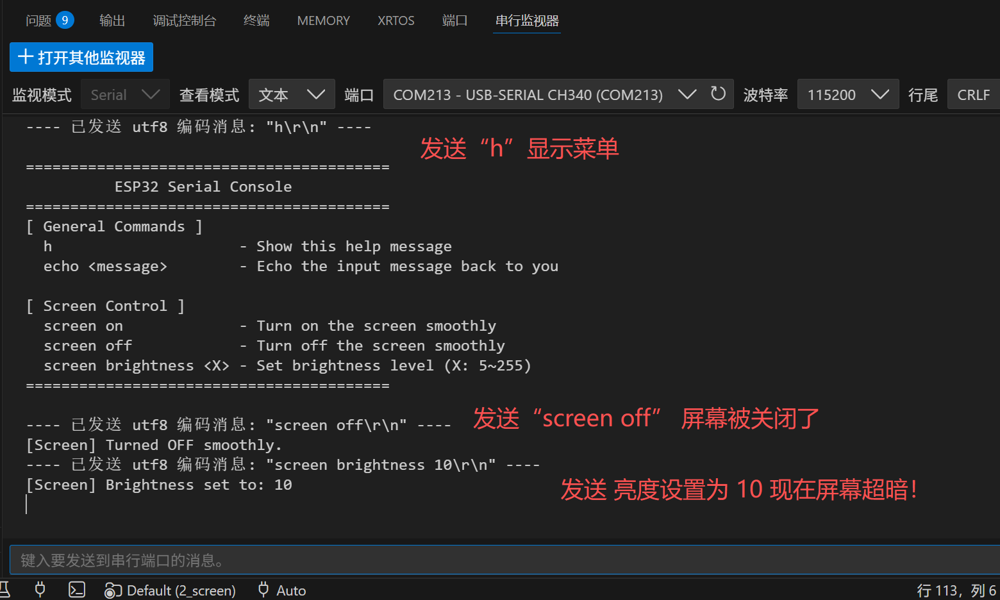

# 第二课 - 点亮屏幕与库自动化管理

在第一课中，我们学会了如何使用 VS Code + PlatformIO 进行基础的编译、烧录和串口通信。今天，我们要玩点更硬核且有趣的——**驱动一块彩色 LCD 屏幕，显示一张可爱的初音未来 图片，并且通过串口命令来控制屏幕的亮度和开关！**

如果你在传统的 Arduino IDE 里配置过 `TFT_eSPI` 这个屏幕驱动库，你一定会记得那段痛苦的回忆：需要深入到系统文件夹深处，找到 `User_Setup.h`，小心翼翼地取消注释各种引脚配置……换了台电脑或者换个项目又要重新搞一遍，极易报错。

但在 PlatformIO 中，**一切都是全自动的！** 让我们来看看这是怎么做到的。

---

## ✨ 本节课解锁的新技能

1. 📦 **全自动库依赖管理 (`lib_deps`)**：告别手动下载 ZIP 包和解压导入库。
2. 🤖 **自动化脚本 (`extra_scripts`)**：让 Python 替你完成繁琐的屏幕引脚配置。
3. 🧩 **代码模块化协作**：让串口模块和屏幕模块“各司其职”又“紧密合作”。

---

## 📂 第二步：项目结构解析

展开左侧资源管理器的 `src` 文件夹，你会发现我们的项目变丰富了：

* **`main.cpp`**：依然是我们的主入口，现在它只需简简单单地调用 `serial_start()` 和 `screen_init()`。
* **`screen.hpp`**：【新朋友】专门负责屏幕初始化、JPEG 图片解码和背光亮度 (PWM) 的控制。
* **`communicate.hpp`**：【老朋友升级】我们给串口命令添加了新分支，用来解析 `screen` 开头的指令。
* **`platformio.ini`**：【核心大脑】所有的魔法都写在这里。
* **`assets/pio_setup_tft_espi.py`**：【幕后英雄】一个极其好用的 Python 脚本。


---

## ⚙️ 第三步：修改`platformio.ini`

双击打开 `platformio.ini` 文件，你会看到这几行关键配置，这是 PlatformIO 秒杀 Arduino IDE 的精髓所在：

### 1. 全自动下库 (lib_deps)
```ini
lib_deps = 
	bodmer/TFT_eSPI@^2.5.43
	bodmer/TJpg_Decoder@^1.1.0
```

在 Arduino IDE 中，你需要去“库管理器”搜索半天。而在 PIO 中，你只需要把库的名字写在这里。当你点击编译时，PIO 会自动从github下载这些库，并且只存放在当前项目的 .pio 隐藏文件夹里，绝不会污染你电脑上的其他项目环境！

### 2. 自动化配置脚本 (extra_scripts)
```ini
extra_scripts = pre:./assets/pio_setup_tft_espi.py
```

屏幕驱动库 TFT_eSPI 强依赖配置文件（引脚定义等）。这行代码的意思是：在每次编译之前 (pre:)，先运行一下我们写的 Python 脚本。 打开 pio_setup_tft_espi.py 你会发现，它会自动把咱们准备好的 esp32_ST7789.h 和 User_Setup_Select.h 复制并替换到库的深处。完美实现了“零手动配置”，拉下代码就能直接跑！

## 💻 第四步：模块化代码 (让串口控制屏幕)
打开 src/communicate.hpp，看看我们是如何让第一课的串口功能控制第二课的屏幕的：
```C
// ... 前面的代码 ...
} else if (input.startsWith("echo ")) {
    String message = input.substring(5);
    Serial.println("Echo: " + message);
} else if (input.startsWith("screen ")) {  
    // 【主要在这里！】一旦检测到输入了 "screen " 开头的命令
    // 就把剩下的工作交给 screen.hpp 里的 screen_cli 函数去处理！
    screen_cli(input);
} else {
// ... 后面的代码 ...
```
这就叫代码的解耦 (Decoupling)。串口文件只负责接收和分发文字，屏幕文件负责具体的执行动作，主程序 main.cpp 干干净净。

## 🚀 第五步：动手测试，看！初音未来！

用数据线连上你的 ESP32 板子：

1. 点击底部工具栏的 **✓ (编译)** 按钮。第一次编译可能会慢一点，因为底部终端正忙着为你自动下载库文件和替换配置文件。
2. 看到终端绿色的 `SUCCESS` 后，点击 **→ (烧录)** 按钮。

烧录完成后，你的屏幕应该会优雅地渐亮，显示出可爱的 Miku 图案！



### 💬 体验串口控制屏幕

1. 点击底部的 **🔌 (插头图标)** 打开串口监视器。
2. 在输入框中试试这些新命令（敲完按回车）：
   * `screen off`：体验屏幕丝滑熄灭（PWM 渐变控制）。
   * `screen on`：体验屏幕丝滑点亮。
   * `screen brightness 50`：将屏幕亮度调暗。
   * `screen brightness 200`：将屏幕亮度调亮。


---

## 🐞 进阶避坑指南 (写给想深入研究的你)

如果你打开 `src/screen.hpp` 查看源码，有两处极其关键的设计：

1. **回调函数保**：`TJpg_Decoder` 解码图片时，必须绑定一个回调函数 `TJpgDec.setCallback(tft_output);`。如果不告诉它该怎么把解码出的像素推送到屏幕上，ESP32 会直接触发内存崩溃并无限重启！
2. **字节序翻转**：源码里有一句 `tft.setSwapBytes(true);`。因为 JPEG 解码出来的数据格式是大端序，而屏幕默认接收小端序，不加这句，你的图片颜色就会完全错乱（比如人的肤色变成阿凡达蓝）。
3. 重新下载程序时，要记得串口监视器停止监视，否则串口被占用时是无法下载程序的。
---

## 🎉 第二课总结

恭喜你！你不仅学会了如何优雅地驱动屏幕，还掌握了 PlatformIO 极其强大的库依赖管理和自动化脚本能力。以后分享项目给别人，对方拉取代码后只需一键即可编译，再也不用满世界找库、改配置了！

在下一课中，我们将尝试驱动OV2640摄像头，敬请期待！