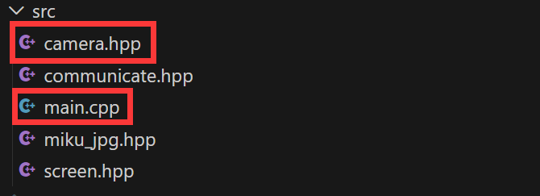
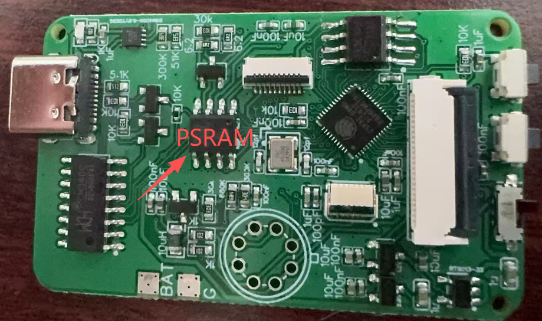
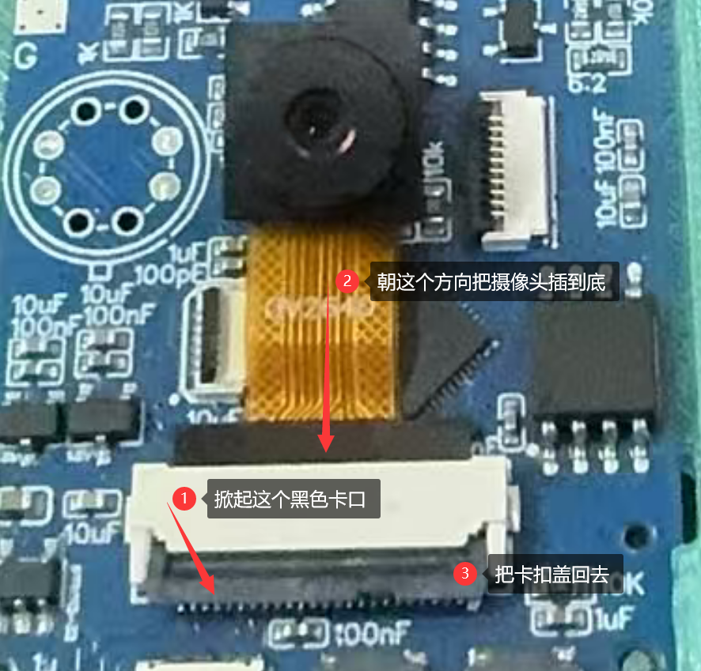
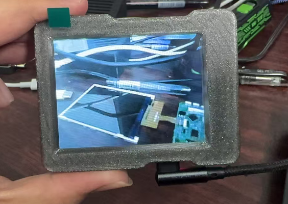

# ESP32 PlatformIO 萌新指南 第三课 - 机器之眼：驱动摄像头

在上一节课中，我们成功点亮了屏幕并显示了可爱的 Miku。今天，我们要给 ESP32 装上“眼睛”，让它能够看清这个世界！

我们将驱动 **OV2640** 摄像头，获取实时的 JPEG 图像流，并利用 ESP32 强大的解码能力，将画面实时投射到我们的 LCD 屏幕上。这可是制作“热成像仪”最关键的地基！

---

## ✨ 本节课解锁的新技能

1. 📷 **ESP32-Camera 驱动**：驾驭复杂的摄像头配置（时钟、引脚、像素格式）。
2. 🧠 **PSRAM (外部伪静态内存)**：理解为什么要用外部内存来存图片。
3. 🔄 **实时视频流管道**：搭建 `摄像头 -> 内存 -> JPEG解码 -> 屏幕` 的高速数据通道。

---

## 📂 第三步：项目结构解析

我们的 `src` 文件夹里多了一位重量级嘉宾：

* **`camera.hpp`**：【新嘉宾】本节课的核心。负责摄像头的引脚定义、上电初始化、图像采集以及将数据喂给屏幕。
* **`screen.hpp`**：【老搭档】依然负责屏幕显示，但这次它要配合摄像头，高频刷新画面。
* **`main.cpp`**：【指挥官】现在的 `loop()` 循环不再空闲，而是全力以赴地搬运图像数据。



---

## ⚙️ 核心原理解析：图像的一生

你可能会好奇，摄像头的数据是怎么跑到屏幕上去的？让我们看看 `camera.hpp` 里：

### 1. 极其复杂的配置 (camera_init)
摄像头不像普通的传感器只有两根线。它有 **8根数据线 (D0-D7)** 并行传输像素，还有 **PCLK (像素时钟)**、**XCLK (系统时钟)** 等控制线。
在 `camera_init()` 函数中，我们将这些引脚一一对应，并设置了关键参数：
* **`pixel_format = PIXFORMAT_JPEG`**：让摄像头直接输出压缩好的 JPEG 图片，否则数据量太大，传输会卡顿。
* **`fb_location = CAMERA_FB_IN_PSRAM`**：**关键点！** 一张图片可能几十 KB，ESP32 内部内存寸土寸金，必须把图片存到外部的 PSRAM 里。



### 2. 搬运工 (camera_loop)
这是主循环中不断运行的代码：

```cpp
void camera_loop(){
    // 1. 抓拍：从摄像头获取一帧画面 (Frame Buffer)
    fb = esp_camera_fb_get();
    
    // 2. 检查：有没有拍到？
    if (!fb) return;

    // 3. 上屏：把 JPEG 数据交给解码器，直接画到屏幕上
    screen_draw_jpeg(fb->buf, fb->len);

    // 4. 释放：把内存归还给驱动，准备存下一张
    esp_camera_fb_return(fb);
}
```

---

## 🚀 第四步：硬件连接与烧录

### ⚠️ 极其重要的硬件提醒
摄像头模组的排线（FPC）非常脆弱且**有方向性**！
1. 确保排线的金手指接触面朝向正确（通常是朝向 PCB 板的触点）。
2. 扣上卡扣时要轻，听到“咔哒”一声才算锁紧。
3. **不要在通电状态下插拔摄像头**，极易烧毁传感器！



### 开始烧录
1. 连接 ESP32，点击底部工具栏的 **→ (烧录)**。
2. 观察底部终端，烧录完成后，打开 **🔌 (串口监视器)**。

如果一切顺利，你会看到：
```text
Serial communication initialized.
Camera init okay
```
紧接着，你的屏幕上就会出现流畅的实时画面了！


---

## 🐞 常见报错与避坑指南 (必看！)

摄像头驱动是报错的重灾区，如果你的串口打印出以下红色错误，请对号入座：

### 1. `Camera probe failed with error 0x105`
* **翻译**：找不到摄像头。
* **原因**：
  * 排线没插好（最常见）。
  * 排线插反了。
  * 摄像头坏了。
  * `camera.hpp` 里的引脚定义（`#define PWDN_GPIO_NUM ...`）和你的电路板不匹配。

### 2. `Brownout detector was triggered`
* **翻译**：电压过低，欠压重启。
* **原因**：摄像头和 WiFi 都是耗电大户。启动瞬间电流过大，电脑 USB 供电不足。
* **解决**：换一根质量好的短数据线，或者给开发板接外部 5V 电源，或者焊接上电池。

### 3. `Guru Meditation Error: Core 1 panic'ed`
* **翻译**：核心崩溃（死机）。
* **原因**：通常是因为没开启 PSRAM。
* **解决**：检查 `platformio.ini` 里是否有这两行：
  ```ini
  build_flags =
    -D BOARD_HAS_PSRAM
    -D CONFIG_SPIRAM=1
  ```

---

## 🎉 第三课总结

恭喜你！你现在已经拥有了一台迷你的“数码相机”。

回顾一下，我们通过 **PlatformIO** 轻松引入了复杂的摄像头驱动，利用 **PSRAM** 解决了内存危机，并复用了第二课的 **JPEG解码** 技能实现了实时图传。

现在，可见光通道已经打通。在下一课，我们将引入 **热成像传感器**。