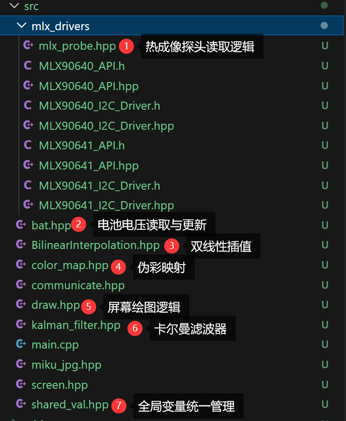
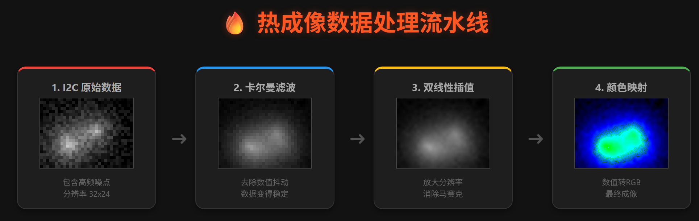
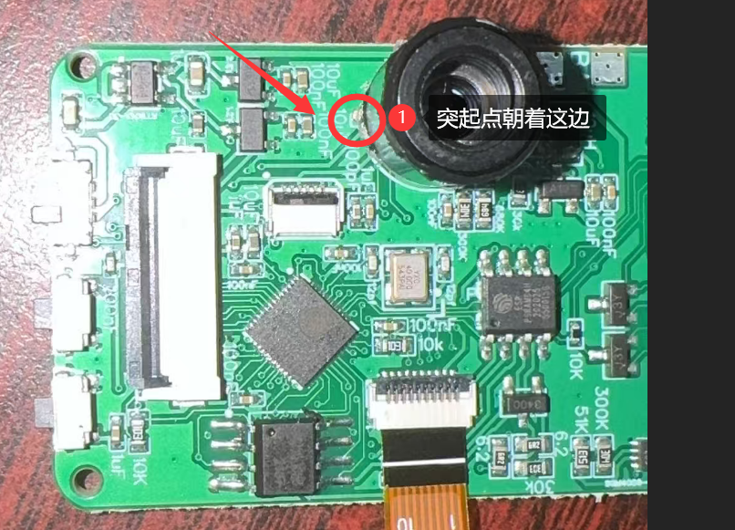
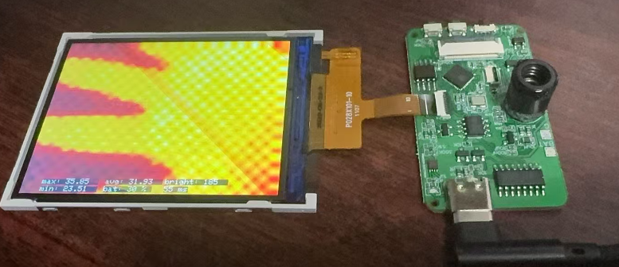

# ESP32 PlatformIO 实战教程 第四课：MLX90640 红外热成像驱动与图像处理

欢迎进入第四课。在上一节中，我们实现了 OV2640 摄像头的图像采集与显示。本节课将聚焦于**非接触式温度测量**领域，驱动 **MLX90640 (或 MLX90641)** 红外热成像传感器阵列。

本项目的核心目标是：通过 I2C 协议获取传感器的原始温度矩阵（32x24 像素），利用数字信号处理算法去除噪声，并通过双线性插值算法将其分辨率提升，最终在 LCD 屏幕上渲染出平滑的伪彩色热力图。

* MLX90640官方API: https://github.com/melexis/mlx90640-library
* MLX90641官方API: https://github.com/melexis/mlx90641-library
---

## 🎯 本课核心知识点

1.  **I2C 总线通信**：掌握 MLX90640 的寄存器操作与 768 点温度数据的高速读取。
2.  **伪彩色映射 (False Color Mapping)**：理解如何将标量温度数据映射为 RGB 颜色空间（热力图）。
3.  **图像缩放算法**：实现**双线性插值 (Bilinear Interpolation)**，将低分辨率的传感器数据映射到高分辨率屏幕。
4.  **数字信号处理**：应用**卡尔曼滤波 (Kalman Filter)** 对原始温度数据进行平滑处理，抑制传感器噪声。

---

## 📂 项目架构解析

为了实现从数据采集到渲染的完整流水线，本课新增了以下核心模块：

* **`src/mlx_drivers/`**：**[硬件抽象层]** 包含厂商提供的底层驱动库，负责处理 I2C 时序和原始数据解析。
* **`mlx_probe.hpp`**：**[采集与处理层]** 负责管理传感器状态机，读取温度帧，并执行卡尔曼滤波算法。
* **`BilinearInterpolation.hpp`**：**[算法层]** 实现了定点数/浮点数优化的双线性插值算法，用于图像上采样（Up-sampling）。
* **`draw.hpp`**：**[渲染层]** 负责将处理后的温度矩阵转换为颜色数据，并绘制 UI 元素（如十字光标、OSD信息）。
* **`shared_val.hpp`**：**[配置与同步]** 定义引脚映射 (Pinout)、传感器参数宏以及多任务间的互斥锁 (Mutex)。

---

## ⚙️ 技术原理解析：数据处理流水线

MLX90640 的原始分辨率仅为 32x24，若直接显示在 320x240 的屏幕上，画面将呈现严重的锯齿状。为了获得可用的热成像画面，数据需经过以下处理流程：

### 1. 数据采集与滤波 (`mlx_probe.hpp`)
ESP32 通过 I2C 接口以 400kHz 或更高频率读取传感器 RAM。
* **原始数据**：传感器输出 768 个浮点温度值。
* **噪声抑制**：由于热电堆传感器存在热噪声，我们对每个像素点应用了一阶**卡尔曼滤波器**。该滤波器能动态评估测量值与预测值的置信度，有效平滑温度跳变，同时保持较好的动态响应。

### 2. 空间分辨率提升 (`BilinearInterpolation.hpp`)
为了适应屏幕分辨率，我们需要对 32x24 的图像进行放大。
* **双线性插值**：这是一种图像重采样算法。对于目标图像中的任意像素点 $(x, y)$，算法会寻找原图中最近的 4 个采样点，根据距离权重进行加权平均。
* **效果**：虽然无法增加真实细节，但能消除马赛克效应，使热力图的颜色过渡自然平滑。

### 3. 伪彩色渲染 (`draw.hpp`)
LCD 屏幕仅接受 RGB 颜色数据。我们需要建立温度到颜色的映射关系（Look-Up Table, LUT）。
* **映射逻辑**：将当前帧的 $[T_{min}, T_{max}]$ 动态映射到 0~255 的色谱索引。
* **色谱定义**：
    * 低温区 $\rightarrow$ 深蓝/黑色
    * 中温区 $\rightarrow$ 紫色/橙色
    * 高温区 $\rightarrow$ 亮红/白色

---

## 🚀 硬件连接与部署

### 🔌 电路连接 (I2C Interface)
请务必确认引脚连接正确，错误的电压可能导致传感器永久损坏。

| MLX90640 引脚 | ESP32 引脚 (定义于 shared_val.hpp) | 备注 |
| :--- | :--- | :--- |
| **VCC** | **3.3V** | **禁止接 5V**，传感器额定电压为 3.3V |
| **GND** | GND | 系统共地 |
| **SDA** | GPIO 23 | I2C 数据线 |
| **SCL** | GPIO 18 | I2C 时钟线 |

> **⚠️ 硬件注意事项：** I2C 总线必须包含**上拉电阻** (Pull-up Resistors)。多数模块已内置 10kΩ 上拉电阻。如果初始化失败，请检查总线电平或虚焊情况。

MLX90640 / MLX90641请按照下图的方向焊接：

### 编译与烧录
1.  在 VS Code 底部状态栏点击 **✓ (Build)**，确保代码编译无误。
2.  点击 **→ (Upload)** 将固件写入开发板。
3.  烧录完成后，复位开发板。

若一切正常，屏幕将显示实时的热力图。你可以尝试将手掌或热源（如烙铁、温水）靠近传感器，观察色彩与光标数值的变化。

---

## 🛠️ 故障排查 (Troubleshooting)

### 1. 串口输出 `MLX Sensor initialization failed!`
* **现象**：程序阻塞在初始化阶段。
* **排查思路**：
    * 检查 I2C 地址是否匹配（默认 0x33）。
    * 检查 SDA/SCL 是否接反或断路。
    * 确认使用的传感器型号（MLX90640 或 MLX90641）与 `shared_val.hpp` 中的宏定义是否一致。

### 2. 画面存在固定噪点或“雪花”
* **原因**：电源纹波过大干扰了微弱的热电堆信号。
* **解决方案**：
    * 不仅电源线供电，还再焊接上电池。
    * 尽量使用纯净的电源供电，避免使用劣质 USB 线。

---

## 📝 总结

至此，你已完成了嵌入式开发中极具挑战性的**多维传感器数据融合**环节：
* **Lesson 1-3**：构建了人机交互（串口）与视觉显示（屏幕/摄像头）的基础设施。
* **Lesson 4**：实现了非可见光数据的采集、滤波与可视化算法。

现在，我们手握“可见光”与“红外光”两套数据源。在下一节（最终课）中，我们将挑战**图像融合算法**，将高分辨率的物体轮廓与低分辨率的温度信息叠加，构建一台完整的、具备专业功能的**双光融合热成像仪**。
