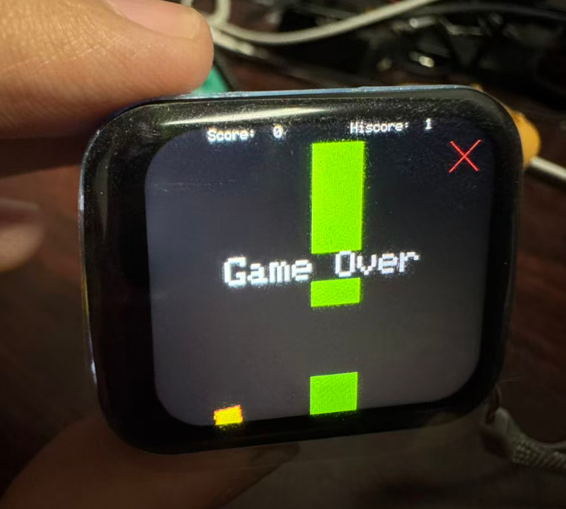

# 第四课：触屏控制

这是一个运行在热成像上的 Flappy Bird 小游戏，用来演示触摸屏驱动功能。




## 功能特性

- 🎮 **触摸操作**：点击屏幕即可开始游戏 / 控制小鸟跳跃 / 游戏结束后重新开始
- 🏆 **最高分记录**：自动保存到 EEPROM，掉电不丢失
- 🖥️ **缓冲绘制**：使用 `TFT_eSprite` 画布减少画面撕裂
- 🔆 **串口控制台**：通过 USB 串口（115200）控制屏幕亮度、开关屏、查看内存占用

## 串口命令

连接串口后输入以下命令：

| 命令 | 说明 |
|------|------|
| `h` | 显示帮助菜单 |
| `echo <msg>` | 回显输入内容 |
| `top` | 查看内部堆内存与 PSRAM 占用 |
| `screen on` | 平滑点亮屏幕 |
| `screen off` | 平滑熄灭屏幕 |
| `screen brightness <X>` | 设置背光亮度（范围 5 ~ 255）|

## 项目结构

```
src/
├── main.cpp          # 程序入口：初始化 + loop 循环
├── screen.hpp        # TFT 屏幕初始化、背光控制、串口 screen 命令处理
├── touch.hpp         # CST816T 触摸驱动 + touch_loop（打印坐标与手势）
├── flappy.hpp        # Flappy Bird 游戏核心逻辑（非阻塞 update 模式）
├── communicate.hpp   # 串口日志格式化与命令解析
└── miku_jpg.hpp      # 开机画面 JPEG 数据
```
