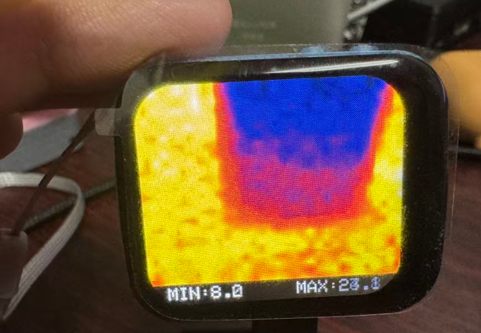

# 第五课：MLX90640驱动

你好，欢迎来到第五课。在这一课里，我们要把一颗 **MLX90640**（或它的兄弟 MLX90641）红外热成像探头真正“跑”起来，并在屏幕上实时绘制出热像图。这个项目运行在 **ESP32-S3** 上，利用其双核特性，把“数据采集”和“界面渲染”彻底解耦。读完这篇文档，你会理解一个完整的热成像驱动是如何分层、如何初始化、如何读取帧数据、如何做温度补偿，以及如何通过双缓冲安全地把数据交给 UI 的。



---

## 一、项目整体架构：双核各司其职

ESP32-S3 的两个核心并不是摆设。在这个项目里，我们做了非常明确的分工：

- **Core 0（探头核心）**：负责传感器初始化、I2C 通信、帧数据读取、温度计算、按钮扫描。它的循环就是“尽快拿到一帧准确的温度数据”。
- **Core 1（UI 核心）**：负责屏幕渲染、触摸事件处理、串口指令交互。它的任务是“把 Core 0 已经算好的数据画出来，并响应用户操作”。

两个核心之间通过**双缓冲 + FreeRTOS 互斥锁**进行通信。Core 0 写完一帧数据后，交换指针并设置 `hasNewData` 标志；Core 1 在渲染前拿到锁，把浮点温度数据映射为颜色索引，然后释放锁，开始耗时较长的绘图操作。这样，绘图不会阻塞传感器采样，传感器采样也不会被绘图打断。

---

## 二、驱动分层：从硬件到应用

我们把驱动逻辑分成了四层，每一层只关心自己该做的事：

```
┌─────────────────────────────────────┐
│  UI 层 (draw.hpp / screen.hpp)      │  颜色映射、插值放大、屏幕推送
├─────────────────────────────────────┤
│  传感器 HAL (sensor_hal.hpp)        │  统一的 detect_and_init / loop 入口
├─────────────────────────────────────┤
│  MLX Probe (mlx_probe.hpp)          │  内存分配、帧循环、后处理、双缓冲交换
├─────────────────────────────────────┤
│  MLX API (MLX90640_API.hpp)         │  EEPROM 解析、温度计算、寄存器配置
├─────────────────────────────────────┤
│  I2C Driver (MLX90640_I2C_Driver)   │  底层 I2C 读写
└─────────────────────────────────────┘
```

**为什么要分层？** 因为 MLX90640 的 datasheet 超过 60 页，内部寄存器、EEPROM 校正参数、温度补偿公式极其复杂。如果把这些代码直接塞在 `loop()` 里，项目将无法维护。分层之后，想换传感器（比如换成 MLX90641）时，只需要改 HAL 层和 Probe 层里的几行判断即可。

---

## 三、初始化：不只是“发几条 I2C 命令”

很多初学者认为驱动初始化就是 `Wire.begin()` 加几个配置寄存器。但对于 MLX90640 来说，**初始化是一场严格的“体检”**。我们在 `blocking_mlx_init_and_check()` 里设计了四步深度检查：

### 步骤 1：I2C 总线握手
MLX90640 的 I2C 地址固定为 `0x33`。我们首先以 800kHz 的频率开启 `Wire1`，并发送一个空的 `beginTransmission` 探测总线是否应答。如果这一步失败，很可能是接线松动或上电时序不对。

### 步骤 2：控制寄存器读取
读取寄存器 `0x800D`，确认传感器已经正常上电并处于可通信状态。这一步可以排除“地址冲突”或“假冒设备”的情况。

### 步骤 3：EEPROM 转储与参数提取（最关键）
MLX90640 内部有 832 个 16-bit 的 EEPROM 单元，里面存储了每一颗芯片出厂时的**唯一校正系数**，包括：
- **VDD 参数**：补偿供电电压漂移
- **PTAT 参数**：芯片结温（Ta）计算
- **Gain 参数**：全局增益校正
- **TGC（热梯度补偿）**：补偿芯片自身发热
- **Alpha 参数**：每个像素的吸收率
- **Offset 参数**：每个像素的零点偏移
- **Kta / Kv 参数**：像素级温度/电压敏感度补偿
- **CP 参数**：补偿像素的参考数据
- **CILC 参数**：棋盘模式下的交错补偿

这些参数通过 `MLX90640_DumpEE()` 一次性读出来，再调用 `MLX90640_ExtractParameters()` 解析进一个巨大的 `paramsMLX90640` 结构体。如果 CRC 或数据格式校验失败，说明 EEPROM 损坏或通信不可靠，必须重新初始化。

### 步骤 4：刷新率与分辨率配置
初始化成功后，我们向控制寄存器写入刷新率和分辨率配置。默认将刷新率设置为 **16Hz**（寄存器值 `0x05`），分辨率设为 19-bit（`0x03`）。对于 MLX90641，配置略有不同，Probe 层会根据 `current_sensor` 自动分流。

只有在四步全部通过后，驱动才会调用 `alloc_mlx_memory()` 分配后续运行所需的全部缓冲区。

---

## 四、帧读取与温度计算流水线

传感器初始化完成后，进入 `probe_loop_mlx()` 循环。每一帧数据的处理流水线如下：

### 1. 等待新帧就绪
`MLX90640_GetFrameData()` 首先轮询状态寄存器 `0x8000` 的 `dataReady` 位。MLX90640 采用**子页（Sub-page）**机制，一帧完整图像被拆成两半交替输出，因此该函数会自动处理子页同步，并一次性读取 832 个 word 的原始帧数据到 `mlx90640Frame` 缓冲区。

### 2. 计算供电电压与环境温度
原始数据只是 ADC 值，必须结合 EEPROM 参数进行补偿：
- `MLX90640_GetVdd()`：根据帧数据中的 Vdd 基准值和 EEPROM 里的 `kVdd`、`vdd25`，计算出传感器当前的实际供电电压。
- `MLX90640_GetTa()`：根据 PTAT（Proportional To Absolute Temperature）传感器数据，计算出芯片的结温 Ta。

### 3. 计算目标温度（To）
这是整个驱动里最复杂的部分，由 `MLX90640_CalculateTo()` 完成。它对每个有效像素执行以下运算：

1. **Gain 补偿**：用 EEPROM 中的 `gainEE` 除以帧数据中的实时增益值。
2. **IR 数据读取**：从帧缓冲区提取原始红外辐射值，转为有符号数后乘上 Gain。
3. **Offset 补偿**：减去该像素在 25°C 下的基准偏移，并根据实时 Ta 和 Vdd 做线性修正。
4. **棋盘模式补偿**（如果开启）：根据像素所在行列的奇偶性，补偿子页交错带来的误差。
5. **发射率修正**：红外能量除以目标发射率（默认 0.95）。
6. **TGC 补偿**：减去两个补偿像素（Corner Pixels）的影响。
7. **Alpha 补偿**：用像素独有的吸收率系数修正辐射强度。
8. **Stefan-Boltzmann 定律反推温度**：
   ```
   To = ⁴√( IR / (α · (1 - ksTo·273.15) + Sx) + taTr ) - 273.15
   ```
   其中 `taTr` 是根据环境温度、发射率和 Ta 修正后的等效辐射背景，`Sx` 是一个与像素特性相关的中间量。由于不同温度区间适用的 `ksTo` 不同，计算还会做**分段迭代**，先用粗略值判断温度区间，再用对应区间的系数做二次精修。

最终，`internal_calc_buffer` 里存放的是每个像素的摄氏温度浮点值。

### 4. 后处理：坏点过滤与极值统计
计算完温度后，我们遍历所有像素做质量过滤：
- 若温度落在 `-41°C ~ 301°C` 之外，视为坏点或通信错误，用相邻像素值简单填补。
- 同时统计这一帧的 `min`、`max`、`avg`，并记录最高温像素所在的行列坐标 `x_max`、`y_max`。

### 5. 双缓冲指针交换
最后，Core 0 获取 `swapMutex`，把 `pWriteBuffer` 和 `pReadBuffer` 的指针互换，将新帧“提交”给 UI。同时更新全局统计变量 `T_max_fp`、`T_min_fp`、`T_avg_fp`，并设置 `hasNewData = true`。

---

## 五、内存管理策略：DRAM 与 PSRAM 的配合

热成像对内存的需求不小，我们做了精细的分配策略：

| 缓冲区 | 大小 | 存放位置 | 用途 |
|--------|------|----------|------|
| `mlxBufferA` / `mlxBufferB` | 834 × float × 2 ≈ 6.6 KB | 内部 Heap | 双缓冲温度数据，供 Core 0 / Core 1 交换 |
| `mlx90640To_buffer` | 834 × uint16_t ≈ 1.7 KB | 内部 Heap | 颜色映射缓存，避免 UI 每次重新做浮点运算 |
| `mlx90640Frame` | 834 × uint16_t ≈ 1.7 KB | DRAM (`MALLOC_CAP_8BIT`) | 原始 I2C 帧数据，要求访问速度快 |
| `internal_calc_buffer` | 834 × float ≈ 3.3 KB | DRAM | 温度计算中间结果 |
| 插值查找表 (`src_x0_table` 等) | 4 × 600 × int16_t ≈ 4.8 KB | PSRAM (`MALLOC_CAP_SPIRAM`) | 双线性插值的 X/Y 坐标查表，数据量大但不频繁随机访问 |

把帧缓冲和计算缓冲放在 DRAM（内部 SRAM）是为了保证 I2C DMA 和浮点运算的速度；把插值查找表放在 PSRAM 是因为 PSRAM 容量大（本项目配置了 2MB QSPI PSRAM），虽然速度稍慢，但完全满足查表需求，从而节省了宝贵的内部 SRAM。

---

## 六、从温度数据到屏幕像素：插值与渲染

MLX90640 的有效分辨率只有 **32×24**。如果直接把 32×24 的方块画到 280×240 的屏幕上，每个“像素”会是一个巨大的色块，视觉效果很差。因此我们在 UI 层引入了**双线性插值放大**。

### 插值原理
在 `mlx_bilinearInterpolation.hpp` 中，我们使用**定点数查表法**加速插值：
- 预先把目标屏幕坐标 `(dst_x, dst_y)` 对应的源图像坐标小数部分，换算成 10 位定点数（`Q = 1024`），并存入 `src_x0_table`、`src_fx_table`、`src_y0_table`、`src_fy_table`。
- 渲染时，对于屏幕上的每一个点，直接查表得到四个相邻源像素的权重，用整数运算完成双线性混合：
  ```
  result = (v00·(Q-fx)·(Q-fy) + v01·fx·(Q-fy) + v10·(Q-fx)·fy + v11·fx·fy) >> 20
  ```

### 缩放策略
- **MLX90640 (32×24)**：放大 9 倍，渲染尺寸为 288×216。
- **MLX90641 (16×12)**：放大 18 倍，同样渲染为 288×216，保证两种传感器在屏幕上的物理尺寸一致。

屏幕分辨率为 280×240。由于插值后的宽度 288 略大于屏幕宽度 280，实际显示时会在水平方向做裁剪或居中对齐；垂直方向 216 像素的热像图会占据屏幕上半部分，底部留出黑边用于显示温度统计信息。

---

## 七、核心设计思想总结

1. **“采集”与“显示”必须分离**：热成像的 I2C 读取和浮点温度计算非常耗时，如果和屏幕渲染放在同一个循环里，刷新率会被严重拖垮。双核 + 双缓冲是唯一的出路。
2. **初始化必须做深度校验**：MLX90640 的 EEPROM 参数是温度精度的生命线，不能简单地“能读到 ID 就认为初始化成功”。
3. **定点数查表是嵌入式浮点运算的救星**：在 240MHz 的 MCU 上，对每个屏幕像素做浮点插值是不可接受的。用 10 位定点数和查表法，可以把插值降到纯整数运算。
4. **内存要分层使用**：内部 SRAM 留给实时性要求高的帧缓冲和计算缓冲；PSRAM 留给体积大、访问频率低的静态查表数据。

---

## 八、给你的思考题

在理解了这套驱动架构后，你可以尝试思考以下问题：

- 如果要把刷新率从 16Hz 提升到 64Hz，I2C 总线带宽和 Core 0 的 CPU 占用分别会受到什么影响？
- `CalculateTo()` 里为什么要分两次计算 `To`（先粗略算区间，再精修）？如果省略第二次精修，温度误差会有多大？
- 双缓冲交换发生在 `xSemaphoreTake` 保护区内，但插值渲染在保护区外。如果 Core 0 交换指针时 Core 1 正在渲染旧帧，是否安全？为什么？
- 如果将来要支持**海曼（Heimann）32×32** 探头，哪些层需要修改，哪些层可以原封不动？

希望这篇文档能帮你建立起对红外热成像驱动的系统认知。下一课，我们可以聊聊如何在这套基础上加入**触摸点测温**和**伪彩色映射的动态调整**。下课！
