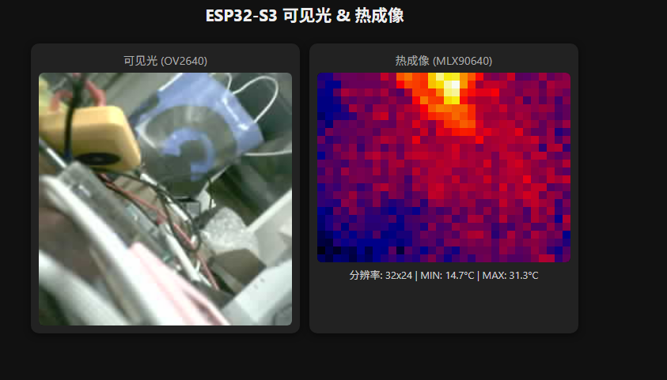
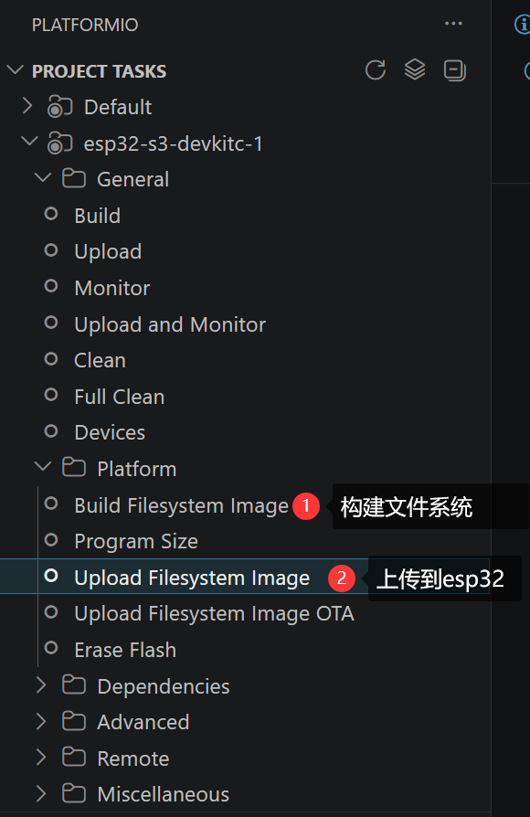

# 第六课：Web 服务器与图像推流

欢迎来到第六课。在前五课中，我们已经让 **ESP32-S3** 同时驱动了屏幕、摄像头、触摸和 MLX90640 热成像传感器。这一课，我们要给设备通过 **WiFi + WebSocket** 把可见光画面和热成像数据实时投射到浏览器上。新增两个解耦的模块（`networks.hpp` 和 `webserver.hpp`），就能让手机或电脑通过网页同时查看双路画面。



---

## 一、项目新增架构：网络层完全解耦

本课在原有双核架构的基础上，增加了**网络与推流层**。为了不破坏之前已经稳定的传感器和屏幕逻辑，我们遵循“**新增文件、极少侵入**”的原则：

```
┌──────────────────────────────────────────────────────
│ 浏览器 (index.html)                                   
│ WebSocket 接收 JPEG + 热成像数据                       
├──────────────────────────────────────────────────────
│ WebServer (webserver.hpp)                            
│ HTTP 服务 + WebSocket 二进制推流。                      
├────────────────────────────────────────────────────── 
│ Network (networks.hpp)                                
│ WiFi STA、扫描、连接、CLI 入口。                        
├────────────────────────────┬──────────────────────────
│ Core 0：传感器 + 按钮       │ Core 1：屏幕+触摸+串口+Web 
└────────────────────────────┴──────────────────────────
```

你只需要在 `main.cpp` 里做**三件事**：
1. `#include "networks.hpp"` 和 `#include "webserver.hpp"`
2. 在 `setup()` 中调用 `network_init()` 和 `ws_init()`
3. 在 `loop()` 中调用 `ws_loop()`

摄像头、热成像、屏幕、触摸的原有代码**一行不改**。

---

## 二、第一步：把网页“烧录”进单片机——LittleFS 文件系统

我们的网页是纯 HTML/JS，文件存放在项目根目录的 `data/` 文件夹下。ESP32 的 Flash 除了存放程序固件（`.bin`），还可以划分出一块区域当作“硬盘”，用来存储网页、配置文件等资源。这里我们使用的是 **LittleFS**。

### 2.1 配置 PlatformIO

在 `platformio.ini` 中，已经通过一行配置启用了 LittleFS：

```ini
board_build.filesystem = littlefs
```

同时，`data/index.html` 就是我们的监控页面，它包含：
- 一个 `` 标签，用于接收并显示摄像头 JPEG 流；
- 一个 `<canvas>` 标签，用于根据热成像数据绘制彩色温度图；
- 一段 WebSocket 客户端脚本，负责与单片机建立连接、解析二进制数据包。

### 2.2 如何上传文件系统

**网页文件不会随固件自动上传**，你需要单独执行文件系统烧录命令。
如果你使用的是 VS Code + PlatformIO 插件，也可以直接点击左侧任务栏的：
- **PlatformIO → Project Tasks → esp32-s3-devkitc-1 → Platform → Build Filesystem Image**
- **PlatformIO → Project Tasks → esp32-s3-devkitc-1 → Platform → Upload Filesystem Image**



> **注意**：如果你忘了上传文件系统，浏览器访问设备 IP 时会看到一行提示 `index.html not found in LittleFS`。这时只需要补上传 `uploadfs` 即可。

---

## 三、连接 WiFi：像 Linux 一样用 `nmcli`

为了让设备连上局域网，我们没有在代码里硬编码 SSID 和密码，而是实现了一个仿 Linux `nmcli` 的命令行工具，全部封装在 `networks.hpp` 中。这样你可以在任何时刻通过串口动态切换 WiFi。

### 3.1 支持的命令

在串口监视器（波特率 115200）里输入 `h` 可以看到网络相关帮助：

```text
[ Network Control ]
  nmcli                                    - Show WiFi connection status
  nmcli dev wifi                           - Scan available WiFi networks
  nmcli dev wifi connect <SSID> password <PWD>  - Connect to a WiFi network
```

### 3.2 实战演示

**1. 扫描周围网络：**
```text
nmcli dev wifi
```
输出示例：
```text
Scanning WiFi...
No.  SSID                     RSSI     CH
1    TP-LINK_5G               -45      36
2    Xiaomi_AB12              -62      6
```

**2. 连接指定网络：**
```text
nmcli dev wifi connect TP-LINK_5G password 12345678
```
连接成功后，串口会打印设备的 IP 地址，例如：
```text
Connected! IP: 192.168.1.123
```

**3. 查看连接状态：**
```text
nmcli
```
输出示例：
```text
=== Network Status ===
State: CONNECTED
SSID: TP-LINK_2.4G
IP: 192.168.1.123
RSSI: -45 dBm
MAC: 7C:DF:A1:xx:xx:xx
======================
```

> **小贴士**：如果你的路由器开启了“双频合一”，建议关闭它，因为 ESP32 仅支持 2.4GHz 频段。

---

## 四、第三步：WebServer 与 WebSocket 推流原理

### 4.1 为什么选 ESPAsyncWebServer？

ESP32 自带一个同步的 `WebServer` 库，但它要求你在 `loop()` 中不断调用 `server.handleClient()`，一旦主循环被传感器或屏幕渲染阻塞，网页就会卡顿甚至断开。而 **ESPAsyncWebServer** 基于 AsyncTCP，所有网络事件都在独立的异步任务中处理，**不占用主循环时间**。这完美契合我们“Core 1 负责 UI + 网络”的架构。

### 4.2 HTTP 路由设计

在 `webserver.hpp` 的 `ws_init()` 中，我们只注册了两条路由：

- **`/` (HTTP GET)**：返回 `data/index.html`。如果 LittleFS 里没有这个文件，就返回一段提示文字，提醒你上传文件系统。
- **`/ws` (WebSocket)**：建立持久连接，用于双向二进制数据传输。

### 4.3 二进制推流协议

为了同时推送摄像头和热成像两路数据，我们在 WebSocket 上自定义了一个极简的二进制协议：

| 首字节 | 含义 | 后续数据 |
|--------|------|----------|
| `0x01` | 可见光 JPEG | 完整的 JPEG 图像字节流 |
| `0x02` | 热成像帧 | `cols(1) + rows(1) + tmin(4) + tmax(4) + pixels(N)` |

**为什么用二进制而不是 Base64 文本？**
- JPEG 本身已经是二进制，如果转 Base64 会增加 33% 体积，推流带宽直接爆炸。
- 热成像每帧 768 个像素（32×24），二进制一个字节一个像素，紧凑高效。

### 4.4 推流循环 `ws_loop()`

这个函数在 `main.cpp` 的 `loop()` 中被调用，控制逻辑如下：

1. **没有人看就休息**：通过 `ws.count() == 0` 判断当前是否有浏览器客户端连接。如果没有，直接 `return`，不浪费 CPU 去取摄像头帧。
2. **摄像头 10fps**：每隔 100ms 调用 `esp_camera_fb_get()` 获取最新 JPEG 帧，首字节标记 `0x01`，通过 `ws.binaryAll()` 广播给所有客户端。
3. **热成像 10fps**：每隔 100ms 通过 `swapMutex` 安全读取 `mlx90640To_buffer`（颜色索引缓冲）和 `T_min_fp` / `T_max_fp`，打包成 `0x02` 帧广播出去。


---

## 五、第四步：前端页面如何解析数据

`data/index.html` 是整个系统的“监控大屏”。它完全运行在手机或电脑的浏览器里，核心逻辑只有两部分：

### 5.1 可见光——Blob + URL.createObjectURL

当收到首字节为 `0x01` 的数据包时，前端把剩余的字节包装成一个 `Blob`（MIME 类型 `image/jpeg`），再用 `URL.createObjectURL()` 生成一个临时图片地址，赋值给 `` 标签的 `src`。上一帧的 Blob URL 会被及时 `revokeObjectURL()` 释放，防止内存泄漏。

```javascript
const blob = new Blob([data.subarray(1)], {type: 'image/jpeg'});
const url = URL.createObjectURL(blob);
camImg.src = url;
```

### 5.2 热成像——Canvas 逐像素渲染

当收到首字节为 `0x02` 的数据包时，前端从二进制中解析出：
- 宽度 `w`（32 或 16）
- 高度 `h`（24 或 12）
- 最低温 `tmin`、最高温 `tmax`（两个 32-bit float）
- 像素数组 `pixels`（每个像素是一个 0~179 的颜色索引）

然后，前端把 32×24 的像素通过**最近邻插值**放大到 320×240 的 Canvas 上。颜色映射表 `colormap` 是直接从 `draw.hpp` 里复制过来的 180 级 RGB565 色阶，前端通过 `rgb565ToRgba()` 把 16-bit 颜色展开为 RGBA，再用 `ctx.putImageData()` 一次性画到画布上。

---

## 六、I2C 资源分配的小心思

细心的同学可能会注意到，本项目的 `camera.hpp` 里有这样几行：

```cpp
config.pin_sccb_sda = -1;
config.pin_sccb_scl = -1;
config.sccb_i2c_port = 1; // 使用 Wire1 进行 SCCB 通信
```

这里 `-1` 的意思是：Camera 驱动**不要**自己重新安装 I2C 驱动，而是**复用外部已经初始化好的 `I2C_NUM_1`**。这样：
- `Wire` (`I2C_NUM_0`) → 42/41，给 MLX 热成像用；
- `Wire1` (`I2C_NUM_1`) → 10/11，给 Touch 和 Camera SCCB 共享用；

三方外设和平共处，互不抢占驱动资源。如果你把 `pin_sccb_sda` 写成 `10`，Camera 就会在底层偷偷安装 `I2C_NUM_1` 驱动，导致 MLX 或 Touch 初始化时报 `i2c driver install error`。

---

## 七、核心设计思想总结

1. **网络层必须完全解耦**：WebServer 和传感器驱动应该是“邻居”而不是“亲戚”。`networks.hpp` 和 `webserver.hpp` 不引用任何屏幕或传感器头文件（除了读取共享的 `swapMutex` 缓冲），主程序也只需要 3 行代码就把它们挂接进来。
2. **文件系统是网页的“硬盘”**：`data/` 目录下的文件必须通过 LittleFS 单独上传，它和固件烧录是两个独立步骤。
3. **CLI 比硬编码更灵活**：用 `nmcli` 命令行管理 WiFi，可以避免每次换路由器都要重新编译固件的尴尬。
4. **二进制 WebSocket 是嵌入式推流的最佳实践**：JPEG 不要转 Base64，温度数据不要拼 JSON。首字节标记类型 + 后面紧跟原始字节，是最省带宽、最省 CPU 的方案。

---

## 八、给你的思考题

- 为什么 `ws_loop()` 要在 `ws.count() == 0` 时直接返回？如果去掉这个判断，会对主循环性能产生什么影响？
- `index.html` 里的热成像渲染用的是**最近邻插值**。如果改成双线性插值，画面会更平滑，但代价是什么？在浏览器端和单片机端分别做插值，各有什么优劣？
- 当前协议中热成像像素只用一个字节（0~179）表示颜色索引。如果将来需要把**原始温度浮点值**也推送到网页（让用户点击任意像素查看精确温度），你会如何扩展这个二进制协议？
- 假设有 3 台手机同时打开监控页面，`ws.binaryAll()` 会把同一帧数据复制 3 份发送。有没有什么方法可以减少重复拷贝，进一步节省内存和 CPU？
