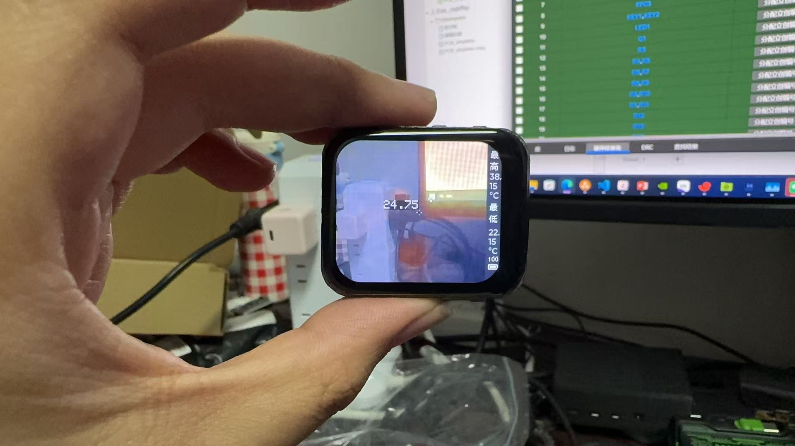

## Umeko Tiny Dual Vison Thermal MLX90640 / Heimann_32x32

*本项目仍然在施工中，请勿参考或使用*

[视频教程](https://www.bilibili.com/video/BV1iTciz7E7s/)
[购买链接](https://item.taobao.com/item.htm?id=1020770415578&mi_id=00000jD4-GaHwYgeZKBIpc_xuM4Hf4V6rFqojSpUaeVI66E&spm=a21xtw.29178619.0.0&xxc=shop)
This project uses PlatformIO to build up firmwares. First you need to install PlatformIO plugins with VSCode to start up your programing.

这个项目使用 PlatformIO 编译固件，首先您应该在VSCODE中安装PlatformIO插件来开始编程或者编译上传固件。这个项目具有教学性质，一步一步教您如何驱动这块开发板实现相应的功能。您可以按数字顺序由浅入深的学习这个项目。

[原理图](Schematic.pdf)

### 可能用得上的物料与链接
[BOM(物料清单)](https://github.com/umeiko/ESP32_Dual_Vision_Thermal/blob/main/0_assembling/BOM(%E7%89%A9%E6%96%99%E6%B8%85%E5%8D%95)%E5%8F%8C%E5%85%89%E8%9E%8D%E5%90%88%E7%83%AD%E6%88%90%E5%83%8F.xlsx)